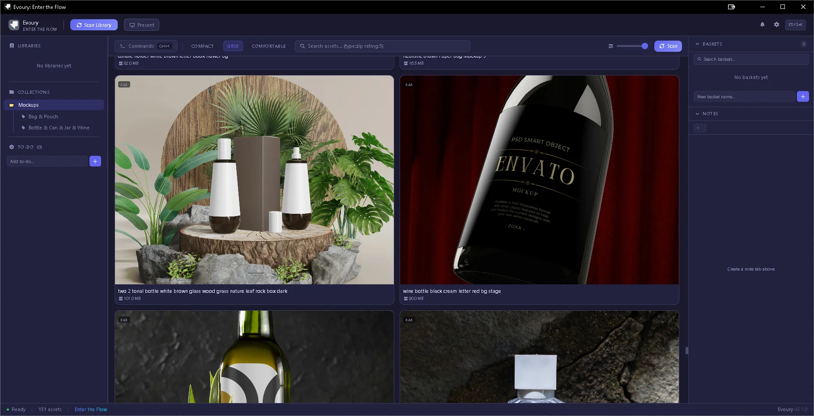
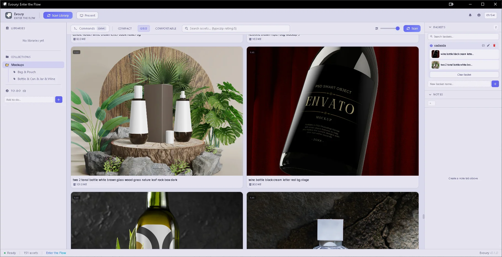
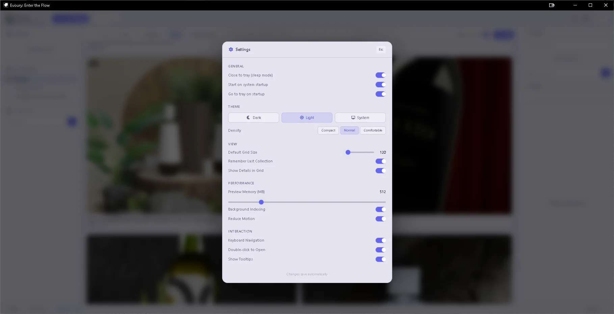

<p align="center">
  
</p>

<h1 align="center">Evoury</h1>

<p align="center">
  <strong>Offline-first Creative Asset Manager</strong>
</p>

<p align="center">
  <a href="#features">Features</a> •
  <a href="#installation">Installation</a> •
  <a href="#development">Development</a> •
  <a href="#architecture">Architecture</a> •
  <a href="#contributing">Contributing</a> •
  <a href="#license">License</a>
</p>

<p align="center">
  
  
  
  
</p>

---

## About

Evoury is a powerful, offline-first creative asset manager built with Tauri, React, and Rust. Designed for creative professionals who need fast, reliable access to their digital assets without compromising on performance or privacy.

### Why Evoury?

- **Offline-first**: Your assets stay on your machine. No cloud dependency.
- **Blazing fast**: Built with Rust for performance that scales with your library.
- **Modular architecture**: 40+ specialized crates for maximum flexibility.
- **Beautiful UI**: Modern, responsive interface built with React and Tailwind CSS.

---

## Features

### Core Engine

- **Multi-format Support**: Images, videos, 3D models, audio, documents, and more
- **Smart Asset Pairing**: Automatically groups related files (e.g., `.blend`, `.fbx`, `.png`)
- **Asset State Machine**: Track assets through discovery, validation, indexing, and archival
- **Event-driven Architecture**: Decoupled services communicating via event bus

### Library Management

- **Advanced Scanner**: Full, incremental, folder-specific, and background scanning modes
- **Filesystem Watcher**: Real-time sync without manual refresh
- **Metadata Pipeline**: Extract, normalize, validate, and cache metadata automatically
- **Duplicate Detection**: SHA256, perceptual hashing, and metadata-based detection

### Search & Organization

- **Persistent Search Index**: Lightning-fast full-text search with FTS5
- **Smart Collections**: Rule-based auto-updating collections
- **Advanced Query Language**: Filter by type, tag, rating, date, camera, and more
- **Search Profiles**: Save and switch between search configurations

### Workspace System

- **Persistent Workspaces**: Remember your entire session state
- **Multiple Workspaces**: Switch between different project contexts
- **Workstations**: Pre-configured layouts with tools, shortcuts, and themes
- **Dockable Panels**: Fully customizable layout engine

### Health & Maintenance

- **Health Engine**: Check filesystem, database, cache, and metadata integrity
- **Automatic Repair**: One-click修复 for detected issues
- **Session Recovery**: Restore workspace after unexpected shutdowns
- **Sleep Mode**: Minimal resource usage when idle

---

## Screenshots

<p align="center">
  
</p>

<p align="center">
  <em>Main Interface - Dark Theme</em>
</p>

<p align="center">
  
</p>

<p align="center">
  <em>Main Interface - Light Theme</em>
</p>

<p align="center">
  
</p>

<p align="center">
  <em>Settings Panel</em>
</p>

---

## Installation

### Prerequisites

- [Rust](https://www.rust-lang.org/tools/install) (latest stable)
- [Node.js](https://nodejs.org/) (v18 or later)
- [pnpm](https://pnpm.io/) (v8 or later)

### Download

Download the latest release from the [Releases](https://github.com/mh3nj/evoury/releases) page.

### Build from Source

```bash
# Clone the repository
git clone https://github.com/mh3nj/evoury.git
cd evoury

# Install dependencies
pnpm install

# Start development server
pnpm tauri dev

# Build for production
pnpm tauri build
```

---

## Development

### Project Structure

```
evoury/
├── crates/                    # Rust crates (backend modules)
│   ├── atlas-core/           # Core domain models
│   ├── atlas-events/         # Event bus system
│   ├── atlas-scanner/        # Library scanning
│   ├── atlas-metadata/       # Metadata pipeline
│   ├── atlas-search/         # Search engine
│   ├── atlas-preview/        # Preview generation
│   ├── atlas-health/         # Health checks
│   ├── atlas-workspace/      # Workspace management
│   ├── atlas-layout/         # Layout engine
│   └── ...                   # 40+ specialized crates
├── src/                       # React frontend
│   ├── components/           # UI components
│   ├── hooks/                # React hooks
│   ├── stores/               # State management
│   ├── pages/                # Page components
│   └── styles/               # Global styles
├── src-tauri/                # Tauri configuration
├── public/                   # Static assets
└── docs/                     # Documentation
```

### Available Scripts

```bash
# Development
pnpm dev              # Start Vite dev server
pnpm tauri dev        # Start Tauri in development mode

# Building
pnpm build            # Build frontend
pnpm tauri build      # Build Tauri app for production

# Testing
pnpm test             # Run frontend tests
cargo test            # Run Rust tests

# Linting
pnpm lint             # Run ESLint
cargo clippy          # Run Clippy
```

### Architecture Overview

Evoury follows a modular, event-driven architecture:

1. **Core Layer**: Pure Rust domain models with no external dependencies
2. **Service Layer**: Specialized services (scanner, preview, search, etc.)
3. **Event Bus**: Decoupled communication between services
4. **Tauri Bridge**: Secure IPC between Rust backend and React frontend
5. **UI Layer**: React components with Zustand state management

For detailed architecture documentation, see [docs/ARCHITECTURE.md](docs/ARCHITECTURE.md).

---

## Tech Stack

### Backend

- **Rust** - Systems programming language
- **Tauri** - Desktop application framework
- **SQLite** - Local database for metadata and search index
- **Crossbeam** - Concurrent programming primitives

### Frontend

- **React** - UI library
- **TypeScript** - Type-safe JavaScript
- **Tailwind CSS** - Utility-first CSS framework
- **Zustand** - State management
- **Vite** - Build tool and dev server

---

## Supported Formats

| Category | Formats |
|----------|---------|
| Images | PNG, JPG, JPEG, GIF, BMP, TIFF, WebP, SVG, PSD, AI, EXR, HDR |
| Videos | MP4, MOV, AVI, MKV, WebM, FLV, WMV |
| 3D Models | OBJ, FBX, GLTF, GLB, STL, BLEND, 3DS, MAX |
| Audio | MP3, WAV, FLAC, AAC, OGG, WMA, M4A |
| Documents | PDF, DOC, DOCX, TXT, RTF, MD |
| Design | Sketch, Figma, XD, PSD |

*Note: Support varies by platform. Some formats may require additional dependencies.*

---

## Roadmap

See [ROADMAP.md](ROADMAP.md) for detailed development roadmap.

### Current Phase: Core Engine

- [x] Domain model implementation
- [x] Event bus system
- [ ] Library scanner
- [ ] Metadata pipeline
- [ ] Search engine
- [ ] Preview system

### Next Phases

- Phase 2: Library Engine
- Phase 3: User Experience & Workspace
- Phase 4: Advanced Features
- Phase 5: Polish & Performance

---

## Contributing

Contributions are welcome! Please read our [Contributing Guide](CONTRIBUTING.md) first.

### Development Setup

1. Fork the repository
2. Clone your fork
3. Create a feature branch
4. Make your changes
5. Run tests and linters
6. Submit a pull request

### Code Style

- **Rust**: Follow `rustfmt` defaults
- **TypeScript**: Follow ESLint configuration
- **Commits**: Use conventional commits

---

## License

This project is licensed under the MIT License - see the [LICENSE](LICENSE) file for details.

---

## Acknowledgments

- [Tauri](https://tauri.app/) - For the amazing desktop framework
- [React](https://react.dev/) - For the UI library
- [Rust](https://www.rust-lang.org/) - For the safe and fast systems language

---

## Support

- **Issues**: [GitHub Issues](https://github.com/mh3nj/evoury/issues)
- **Website**: [mh3n.com](https://mh3n.com)

---

<p align="center">
  Built by <a href="https://github.com/mh3nj">Mohsen Jafari</a><br>
  Founder of <a href="https://parsegan.com">Parsegan</a> (Brand Identity) & <a href="https://dahgan.com">Dahgan</a> (Software)
</p>
